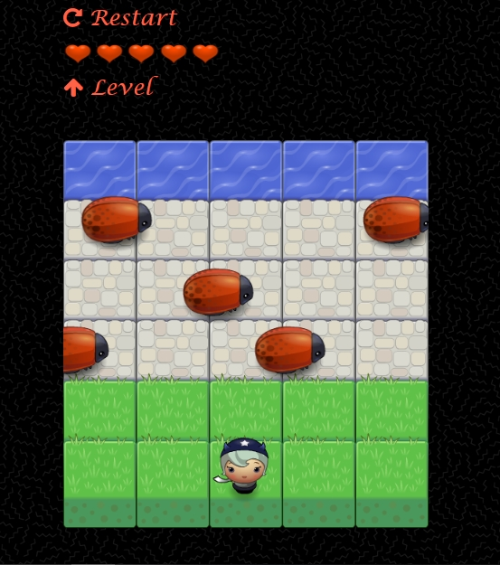
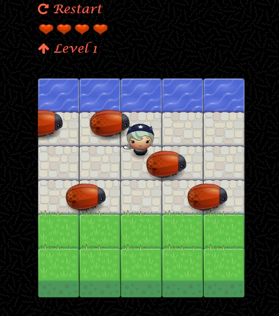
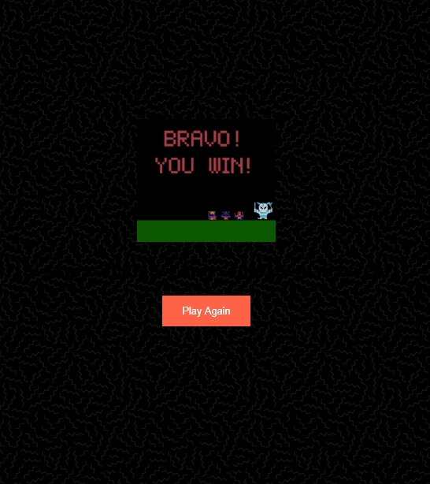
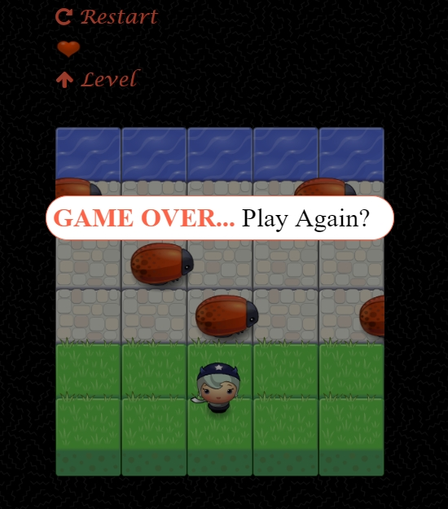

# Classic Arcade Game Project

## Table of Contents

- How to Run 
- How to Play
- About the project
- Screenshots

## How To run the game
- download or clone the project to your computer.
- open index.html file.
- enjoy the game.

## How to Play
- Your goal is to make it safely to the water, without colliding with any passing bugs.
- use arrow keys to move about the space.
- you have 5 lives which decreases each time a collision with a bug happens.
- each time you reach the water, you get level up.
- with each level up, the speed of the passing buge increases.
- the game is 10 levels total.

## About the Project 
his project is a part of the udacity Front-End web development Nanodegree program.

## Screenshots

